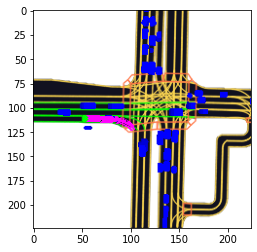
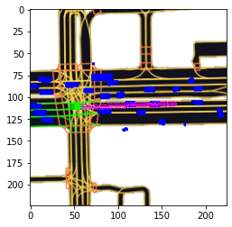

[](https://pycqa.github.io/isort/)
[](https://github.com/psf/black)
[](https://www.deepcode.ai/app/gh/Fkaneko/kaggle-lyft-motion-pred/_/dashboard?utm_content=gh%2FFkaneko%2Fkaggle-lyft-motion-pred)

## Description
Training and Prediction code for Kaggle competition,
[Lyft Motion Prediction for Autonomous Vehicles](https://www.kaggle.com/c/lyft-motion-prediction-autonomous-vehicles/overview).
The target is motion predicion over 5 sec for each vehicle, the pink track below. Each prediction is evaluated with
["multi-modal negative log-likelihood loss"](https://github.com/lyft/l5kit/blob/master/competition.md).






## How to run
First, download the data, [here](https://www.kaggle.com/c/lyft-motion-prediction-autonomous-vehicles/data),
and full training data, [here](https://www.kaggle.com/philculliton/lyft-full-training-set).
You will get the followings.
```bash
/your/dataset/root_path
    │
    ├ meta.json
    ├ single_mode_sample_submission.csv
    ├ multi_mode_sample_submission.csv
    ├ aerial_map/
    ├ semantic_map/
    └ scenes/
        ├ mask.npz
        ├ sample.zarr
        ├ test.zarr
        ├ train.zarr
        ├ train_full.zarr
        └ validate.zarr
```

Install dependencies,
```bash
# clone project
git clone https://github.com/Fkaneko/kaggle-lyft-motion-pred

# install project
cd kaggle-lyft-motion-pred
pip install -r requirements.txt
 ```
 Run training and testing it,
 ```bash
# run training
python run_lyft_mpred.py  \
           --l5kit_data_folder \
           /your/dataset/root_path \
           --epochs \
           1 \
           --lr \
           5.2e-4 \
           --batch_size \
           128 \
           --num_workers \
           4
# run test
python run_lyft_mpred.py  \
           --l5kit_data_folder \
           /your/dataset/root_path \
           --is_test \
           --ckpt_path \
           /your/trained/ckeckpoint_path
           --batch_size \
           128 \
           --num_workers \
           4
```
After testing you will find ``./submission.csv``, and you can check the test score
throguh [this notebook](https://www.kaggle.com/corochann/save-your-time-submit-without-kernel-inference).


## Competition summary
[The baseline CNN regression approach](https://www.kaggle.com/lucabergamini/lyft-baseline-09-02),
just replacing the 1st and final layers of Imagenet pretrained model, was strong.
Segmentaion or RNN approeches are not good.  And following tips we can get
top-10 equivalent performance(11.238) using the baseline approach.

* [Directly optimize evaluation metric](https://www.kaggle.com/corochann/lyft-training-with-multi-mode-confidence).
The target metric ["multi-modal negative log-likelihood loss"](https://github.com/lyft/l5kit/blob/master/competition.md).
is differential.

* [Use the same filtering configuration as test data is generated](https://www.kaggle.com/c/lyft-motion-prediction-autonomous-vehicles/discussion/199657), it means
    `MIN_FRAME_HISTORY = 0` and `MIN_FRAME_FUTURE = 10` at
    [`l5kit.dataset.AgentDataset`](https://github.com/lyft/l5kit/blob/082359ae88a53326e6693568760815597e364054/l5kit/l5kit/dataset/agent.py#L20).

* Use all train data, in total 198474478 agents. It's really huge but
the loss continuously decrease during training.

Actually I got the following result.  The history_frames was 10 at the baseline so if you can use 10 instead of 2
you may get better result than top-10 score, 11.283 with this single model.


| model      | backbone    | scenes | iteration x batch_size | loss        | history\_frames                  | MIN_FRAME_HISTORY / FUTURE | test score |
| -          | -           | -      | -                      | -           | -                                | -                          | -          |
| baseline   | resnet50    | 11314  | 100k x 64              | single mode | 10                               | 10/1                       | 104.195    |
| this study | seresnext26 | 134622 | 451k x 440             | multi-modal | 2 (10->2 due to time constraint) | 0/10                       | 11.378     |

**[Note]** The backbone difference is not a matter, within top-10 solution a single resnet18 reaches score < 10.0.
But smaller model tends to be better for this task.

### Reference
<!--  -->
* [Github templete from PytorchLighting](https://github.com/PyTorchLightning/deep-learning-project-template).
* [Nine simple steps for better-looking python code](https://towardsdatascience.com/nine-simple-steps-for-better-looking-python-code-87e5d9d3b1cf).
* For the dataset, [l5kit](https://github.com/lyft/l5kit).
* Leaderboad, [kaggle competition page](https://www.kaggle.com/c/lyft-motion-prediction-autonomous-vehicles/leaderboard).
